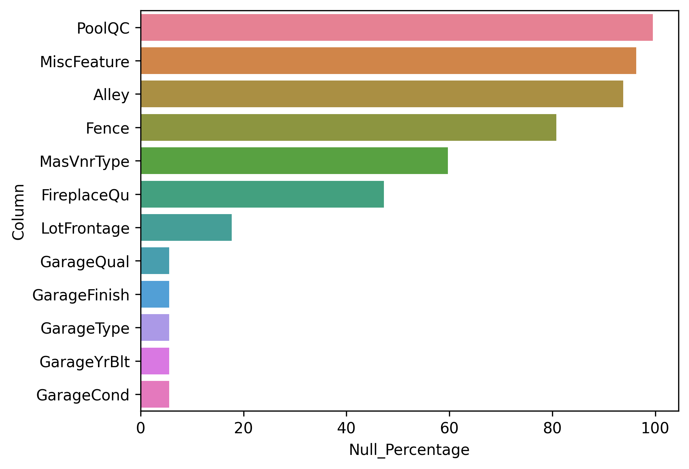
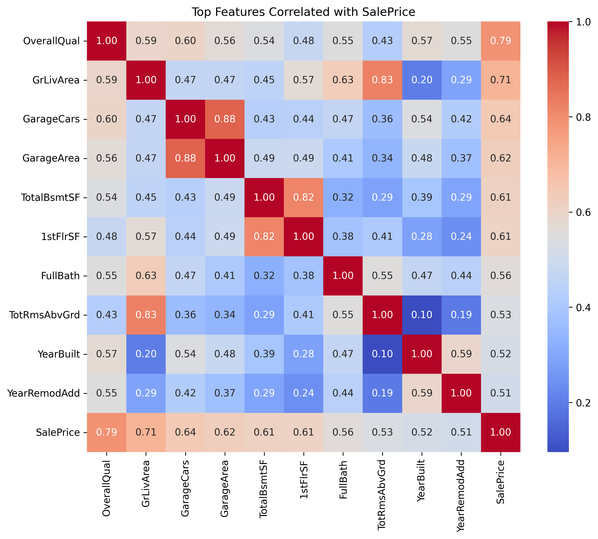
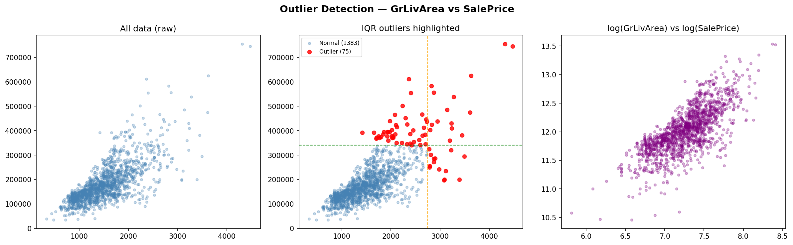
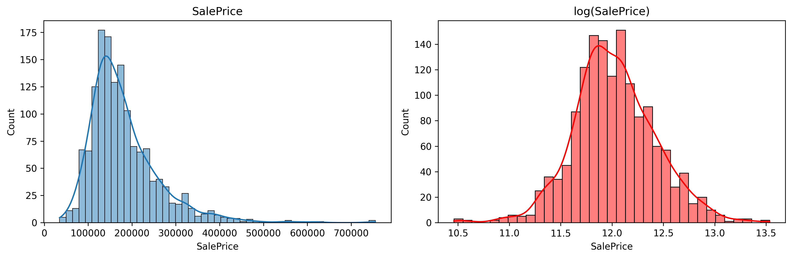

# 🏠 House Price Prediction Project

## 📌 Project Overview

This project focuses on analyzing housing data and building machine learning models to predict house prices. The workflow includes:

- Data Collection
- Exploratory Data Analysis (EDA)
- Data Cleaning
- Feature Engineering
- Visualization
- Model Development
- Model Evaluation

---

## 📂 Project Structure

```text
ML_MODEL/
│
├── data/                     # Raw and processed datasets
├── charts/                   # Generated visualizations and plots
├── output/                   # Model outputs and prediction files
├── PROJECT_GG1/              # Additional project resources
│
├── House_Prices_EDA.ipynb    # Complete EDA notebook
├── week1_day6_drills.ipynb   # Practice exercises
├── week2_seborn_eda_project.ipynb # Seaborn EDA project
├── main.py                   # Main Python script
├── README.md                 # Project documentation
└── .gitignore                # Ignored files and folders
```

---

## 🎯 Objectives

- Understand housing market trends.
- Perform exploratory data analysis.
- Identify important features affecting house prices.
- Handle missing values and outliers.
- Build predictive machine learning models.
- Evaluate model performance using appropriate metrics.

---

## 🛠️ Technologies Used

### Programming Language

- Python 3.x

### Libraries

- NumPy
- Pandas
- Matplotlib
- Seaborn
- Scikit-Learn
- XGBoost (Optional)

---

## 📊 Exploratory Data Analysis

Key analyses performed:

- Missing Value Analysis
- Distribution Analysis
- Correlation Analysis
- Feature Importance
- Outlier Detection
- Categorical Feature Analysis
- Numerical Feature Analysis

Example visualizations:

- Histograms
- Boxplots
- Heatmaps
- Pairplots
- Countplots
- Scatterplots

---

## 🚀 Installation

Clone the repository:

```bash
git clone https://github.com/your-username/ML_MODEL.git
cd ML_MODEL
```

Create virtual environment:

```bash
python -m venv mlenv
```

Activate environment:

### Windows

```bash
mlenv\Scripts\activate
```

### Linux/Mac

```bash
source mlenv/bin/activate
```

Install dependencies:

```bash
pip install -r requirements.txt
```

---

## ▶️ Running the Project

### Run EDA Notebook

```bash
jupyter notebook
```

Open:

```text
House_Prices_EDA.ipynb
```

### Run Python Script

```bash
python main.py
```

---

## 📈 Model Evaluation Metrics

The project may use:

- MAE (Mean Absolute Error)
- MSE (Mean Squared Error)
- RMSE (Root Mean Squared Error)
- R² Score

---

## 📁 Outputs

Generated outputs are stored in:

output/


Visualizations are stored in:
charts/





## 🔮 Future Improvements

- Hyperparameter Tuning
- Feature Selection
- Ensemble Models
- Model Deployment using Flask/FastAPI
- Docker Containerization
- CI/CD Integration

---

## 👨‍💻 Author

**Pankaj Kumar**

Machine Learning & Data Science Enthusiast

GitHub: https://github.com/kumarpankaj161

---

## 📜 License

This project is intended for learning and educational purposes.